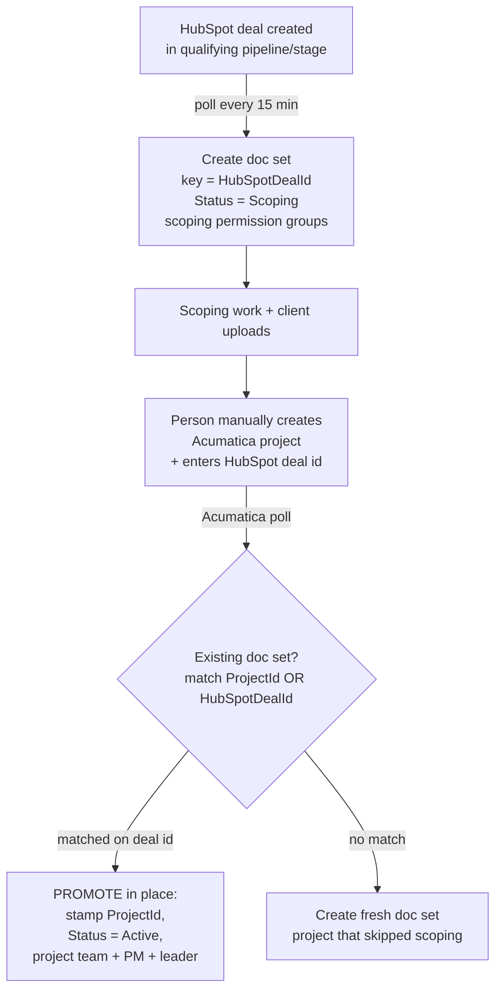

# HubSpot Scoping → SharePoint Workspace Integration (Design)

**Status:** Draft for discussion · **Date:** 2026-08-14

## Purpose

Today the system creates a SharePoint workspace (document set) for each **Acumatica project** — i.e. once an engagement has reached the ERP. We want to create that workspace **earlier**, during the **scoping phase**, sourced from a **HubSpot deal**, so the team has a place to collect documents (including client uploads) before the project exists in Acumatica.

Guiding principle: **one workspace per engagement for its entire life.** It is born at scoping (from HubSpot) and *promoted* in place when it becomes a project (in Acumatica) — never duplicated.

## Baseline (what exists today)

- Poll the Acumatica GI every 15 min → normalized record `{ Id, Customer, Project, Practice, PM, Team }`.
- Create/reconcile a SharePoint **document set** with metadata, authoritative permissions, and an optional anonymous client-upload link.
- A **reconcile engine** keeps tracked sets in sync, gated by a SHA-256 signature so unchanged items cost zero SharePoint writes.

## Locked decisions

| Decision | Choice |
|---|---|
| Trigger | **Poll** HubSpot (not webhook) — consistent with Acumatica, resilient, no public endpoint |
| Workspace location across phases | **In place**, one folder; a **`Status`** column flips `Scoping → Active`. No folder moves. |
| HubSpot → Acumatica conversion | **Manual** (a person creates the Acumatica project) |

## Target lifecycle



## The linchpin: the correlation key

A single engagement has **two different identifiers** over its life — a HubSpot **deal id** and an Acumatica **project id (ContractCD)**. To promote (rather than duplicate) the workspace, the Acumatica sync must recognize "this project already has a scoping folder."

**Mechanism:** at manual conversion, the person enters the **HubSpot deal id into a custom field on the Acumatica project.** The Acumatica sync then does its idempotency lookup by **`ProjectId` OR `HubSpotDealId`**; a deal-id match = a promotion.

**Why this is the critical item:** since conversion is manual, this field is the *only* thread linking the two systems. It is one extra field on an already-manual step (low friction), but:

- **If left blank**, that engagement gets a **second folder** when it hits the ERP. Recoverable, but a manual merge.
- **Mitigations:** validate the deal-id format on entry; log every promotion that *didn't* find a scoping folder (so mismatches surface); provide an admin "link these two" action as a safety valve.

## Data model (document-set columns)

| Column | Scoping | Active | Notes |
|---|---|---|---|
| `HubSpotDealId` | set | set | idempotency key at scoping; retained after promotion |
| `ProjectId` (Acumatica) | blank | set | stamped at promotion; idempotency key thereafter |
| `Status` | `Scoping` | `Active` | drives filtered views/reporting |
| `Customer`, `Project` | set | set (refreshed from Acumatica) | source of truth shifts to Acumatica after promotion |
| existing metadata / signature | — | — | unchanged |

## Permissions by phase

The authoritative-permissions model already recomputes the full grantee set on every reconcile, so phase-specific access is just "which grantees the source computes":

- **Scoping:** scoping/BD groups + practice leader *(membership TBD)*.
- **Active:** project team (EPEmployeeContract) + PM + practice leader — the current behavior.

Promotion simply re-applies permissions for the new phase; manual grants are wiped as they are today.

## Code shape

Introduce a **source abstraction** so HubSpot doesn't become a parallel copy of the pipeline:

```
ISyncSource  ──►  emits normalized record + destination/permission mapping + phase
   ├── AcumaticaClient   (existing)
   └── HubSpotClient     (new)
```

The SharePoint document-set service, reconcile engine, signature gating, and upload-link logic are **reused unchanged**. Only "who gets access," "what status," and "which source key" become functions of `(source, phase)`.

## HubSpot specifics

- **Auth:** HubSpot **private-app access token** (bearer) — simpler than Acumatica's ROPC.
- **API:** CRM v3 `POST /crm/v3/objects/deals/search` filtered on `hs_lastmodifieddate > watermark`; expand associations → company for the customer name; read deal name, owner, stage.
- **Watermark:** a dedicated blob watermark for the HubSpot cursor (same pattern as the reconcile cursors).
- **Scope:** only deals in the qualifying pipeline/stage(s) create workspaces *(TBD)*.

## Open questions for discussion

1. **Which HubSpot pipeline/stage(s)** should trigger a scoping workspace?
2. **Scoping permission groups** — who are they (BD, scoping team, practice leader)?
3. **Acumatica custom field** for the deal id — field name, and who owns adding it to the conversion process/form?
4. **Practice at scoping time** — is the practice known from the deal (drives the SharePoint destination), or only once in Acumatica?
5. **Dead deals** — deals that die in scoping: leave as `Scoping`, archive, or clean up on a cadence?
6. **Client-upload links during scoping** — enable at scoping (likely yes), or only once active?

## Suggested phasing

- **Phase 1** — HubSpot poll + create scoping doc set with `Status = Scoping` and scoping permissions. Standalone value even before promotion is wired.
- **Phase 2** — promotion: Acumatica idempotency lookup gains the `HubSpotDealId` path; flips status and permissions in place.
- Reconcile, permissions, and upload links come along for free.
