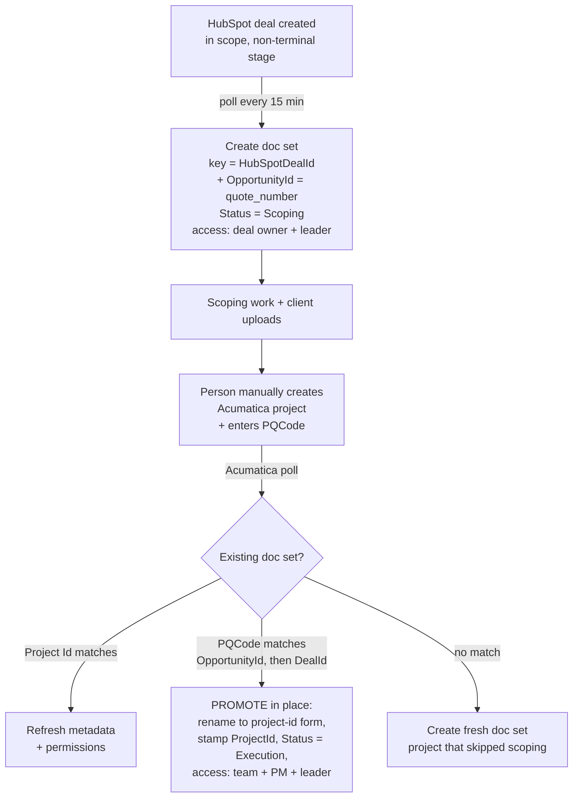

# HubSpot Scoping → SharePoint Workspace Integration (Design)

**Status:** Phase 1 + Phase 2 (promotion) implemented · **Date:** 2026-08-18

## Purpose

Today the system creates a SharePoint workspace (document set) for each **Acumatica project** — i.e. once an engagement has reached the ERP. We want to create that workspace **earlier**, during the **scoping phase**, sourced from a **HubSpot deal**, so the team has a place to collect documents (including client uploads) before the project exists in Acumatica.

Guiding principle: **one workspace per engagement for its entire life.** It is born at scoping (from HubSpot) and *promoted* in place when it becomes a project (in Acumatica) — never duplicated.

## Baseline (what exists today)

- Poll the Acumatica GI every 15 min → normalized record `{ Id, Customer, Project, Practice, PM, Team }`.
- Create/reconcile a SharePoint **document set** with metadata, authoritative permissions, and an optional anonymous client-upload link.
- A **reconcile engine** keeps tracked sets in sync, gated by a SHA-256 signature so unchanged items cost zero SharePoint writes.

## Locked decisions

| Decision | Choice |
|---|---|
| Trigger | **Poll** HubSpot (not webhook) — consistent with Acumatica, resilient, no public endpoint |
| Workspace location across phases | **In place**, one folder; a **`Status`** column flips `Scoping → Active`. No folder moves. |
| HubSpot → Acumatica conversion | **Manual** (a person creates the Acumatica project) |
| Correlation key | The **HubSpot opportunity number** (`quote_number`, e.g. `PQ005871`) recorded in the Acumatica GI's **`PQCode`** column |
| Permissions at promotion | **Clean reset** — the delivery team replaces the deal owner. Deal team and delivery team are deliberately separate. |
| Folder name at promotion | **Renamed** in place to the project-id form, so the library reads consistently |

## Target lifecycle



## The linchpin: the correlation key

A single engagement carries **two identifiers** over its life — a HubSpot deal and an Acumatica **project id
(ContractCD)**. To promote rather than duplicate, the Acumatica sync must recognize "this project already has
a scoping folder."

**Mechanism (as built):** the Acumatica GI exposes a **`PQCode`** column (`Acumatica:HubSpotLinkField`),
populated at conversion with the HubSpot **opportunity number** — the `quote_number` deal property, labelled
*Opportunity #* in HubSpot, with values like `PQ005871`. On each poll the sync looks for an existing set by:

1. the **Project Id** column — already-tracked project, just refresh it;
2. failing that, and only when `PQCode` is non-blank, the **`OpportunityId`** column, then the
   **`HubSpotDealId`** column — a hit on either is a **promotion**.

The two-column fallback means it links whichever identifier a person actually recorded: the human-facing
opportunity number, or the raw HubSpot record id pasted from the deal URL.

**Why two columns, not one.** The scoping workspace keys idempotency on the **deal id**, which is immutable.
The opportunity number is *not* — it can be assigned after the deal is created, or corrected later. Keying
the workspace on a mutable value would make a late-arriving opportunity number look like a brand-new
engagement and produce exactly the duplicate this design exists to prevent. So: deal id is identity,
opportunity number is the correlation key, and both live on the set.

**This is still the single point of failure**, because conversion is manual:

- **`PQCode` left blank** → the engagement gets a **second folder** when it reaches the ERP. Recoverable, but
  by hand. Every occurrence is logged as a warning (`carries HubSpot link … but no scoping workspace
  matched`), and `ProjectSyncDryRun` reports how many projects in the window carry a link at all.
- **Two projects with the same `PQCode`** → the second one does *not* hijack the first one's workspace; it is
  logged and gets its own folder.

> **Not yet true in production (2026-08-18):** `PQCode` is present on the GI but **null on all 8,929 rows**,
> including projects created the same day. Until something populates it at conversion, every project takes
> the "no match" branch and promotion never fires. Verify with one real conversion before trusting it.

## Data model (document-set columns)

| Column | Scoping | Active | Notes |
|---|---|---|---|
| `HubSpotDealId` | set | set | immutable identity; idempotency key at scoping, retained after promotion |
| `OpportunityId` | set | set | `quote_number` / *Opportunity #*; the value `PQCode` is matched against |
| `ProjectId` (Acumatica) | blank | set | stamped at promotion; idempotency key thereafter |
| `Status` | `Scoping` | `Active` | drives filtered views/reporting |
| `Customer`, `Project` | set | set (refreshed from Acumatica) | source of truth shifts to Acumatica after promotion |
| existing metadata / signature | — | — | unchanged |

## Permissions by phase

The authoritative-permissions model already recomputes the full grantee set on every reconcile, so phase-specific access is just "which grantees the source computes":

- **Scoping:** scoping/BD groups + practice leader *(membership TBD)*.
- **Active:** project team (EPEmployeeContract) + PM + practice leader — the current behavior.

Promotion simply re-applies permissions for the new phase; manual grants are wiped as they are today.

**Decided 2026-08-18 — clean reset.** The deal owner is *not* carried forward. Promotion replaces the scoping
grantees with the delivery team, and the deal team is treated as a separate population from the delivery team.
Consequence to be aware of: whoever scoped the engagement loses the folder at promotion unless they are the PM
or on the Acumatica project team. Re-adding them by hand holds only until the next signature change, then the
authoritative reset silently removes them again.

**Demotion guard.** A promoted workspace keeps its `HubSpotDealId`, so the HubSpot poll still matches it. Left
unguarded, any later edit to that deal would re-apply the *scoping* state — flipping `Status` back to
`Scoping` and resetting access to the deal owner, wiping the delivery team. The scoping path therefore skips
any workspace whose `Project Id` is already populated. (`HubSpot:TerminalStageIds` only covers this when the
deal is closed *before* the project is created, which is not guaranteed.)

## Code shape

Introduce a **source abstraction** so HubSpot doesn't become a parallel copy of the pipeline:

```
ISyncSource  ──►  emits normalized record + destination/permission mapping + phase
   ├── AcumaticaClient   (existing)
   └── HubSpotClient     (new)
```

The SharePoint document-set service, reconcile engine, signature gating, and upload-link logic are **reused unchanged**. Only "who gets access," "what status," and "which source key" become functions of `(source, phase)`.

## HubSpot specifics

- **Auth:** HubSpot **private-app access token** (bearer) — simpler than Acumatica's ROPC.
- **API:** CRM v3 `POST /crm/v3/objects/deals/search` filtered on `hs_lastmodifieddate > watermark`; expand associations → company for the customer name; read deal name, owner, stage.
- **Watermark:** a dedicated blob watermark for the HubSpot cursor (same pattern as the reconcile cursors).
- **Scope:** only deals in the qualifying pipeline/stage(s) create workspaces *(TBD)*.

## Open questions for discussion

1. **Which HubSpot pipeline/stage(s)** should trigger a scoping workspace?
2. **Scoping permission groups** — who are they (BD, scoping team, practice leader)?
3. ~~**Acumatica custom field** for the deal id — field name?~~ **Answered:** the GI's `PQCode` column, carrying
   HubSpot's `quote_number`. Still open: **who owns populating it** at conversion, and validating its format —
   it is null on every row today.
4. **Practice at scoping time** — is the practice known from the deal (drives the SharePoint destination), or only once in Acumatica?
5. **Dead deals** — deals that die in scoping: leave as `Scoping`, archive, or clean up on a cadence?
6. **Client-upload links during scoping** — enable at scoping (likely yes), or only once active?

## Suggested phasing

- **Phase 1** *(done)* — HubSpot poll + create scoping doc set with `Status = Scoping` and scoping permissions.
- **Phase 2** *(done)* — promotion: the Acumatica lookup gained the `OpportunityId` / `HubSpotDealId` path, and
  flips name, status, and permissions in place.
- **Phase 3** *(remaining, process not code)* — get `PQCode` populated at conversion, then validate end-to-end
  with one real deal → project.
